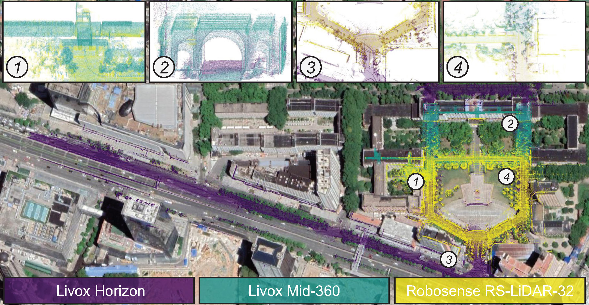

# dvmm
> **DVMM: A Dual-View Combination Descriptor for Multi-Modal LiDARs Online Place Recognition**



## Introduction
DVMM is an online place recognition method for multi-modal LiDARs. This method introduces a dual-view combination descriptor, termed DVMM, by separately encoding azimuthal and vertical scene information. The place recognition process consists of two stages: loop closure detection and verification. In the detection stage, point clouds are projected onto an adaptive grid and a 1D azimuthal descriptor is generated via Gaussian weighted column summation. The azimuthal descriptor is utilized to retrieve potential loop candidates through vector matching. In the verification stage, point clouds within a fixed height range are encoded as a binary occupancy image, which serves as the cross-section descriptor. Accurate loop closures are determined by performing image matching on the cross-section descriptors.

## How to Use

This project was tested on Ubuntu 18.04 and requires several common C++ libraries.

### 1. Pre-requisites

Make sure the following dependencies are installed:

- [CMake](https://cmake.org/) >= 3.10  
- [PCL](https://github.com/PointCloudLibrary/pcl) >= 1.8.0  
- [OpenCV](https://opencv.org/) >= 3.2.0  
- [Eigen](http://eigen.tuxfamily.org/index.php?title=Main_Page) >= 3.3.4  
- [Boost](https://github.com/boostorg/boost) >= 1.65  
- [yaml-cpp](https://github.com/jbeder/yaml-cpp) >= 0.6.0 (for parsing YAML config files)  

You can install most of these using `apt`:

```bash
sudo apt-get update
sudo apt-get install -y build-essential cmake
sudo apt-get install -y libpcl-dev libopencv-dev libeigen3-dev libboost-all-dev libyaml-cpp-dev
```

### 2. Compile
Clone this repository and build

```bash
git clone https://github.com/duanxz0127/dvmm.git
cd dvmm
mkdir build
cd build
cmake ..
make -j4
```

### 3. Prepare data
We provide the demo data at [OneDrive](https://1drv.ms/f/c/fd72da3394f988c8/Er8Kqop3_u9CjW30TAGYjzUBsUPZXWh11RBGfynl192jTA?e=HfcgJH).


### 4. Run
```bash
cd ../script
sh run.sh
```
Before running, please open run.sh and modify the following variables:

- **QUERY_PCD_DIR**: Path to the folder containing the query point cloud submaps.

- **REFERENCE_PCD_DIR**: Path to the folder containing the reference point cloud submaps.

- **CONFIG_PATH**: Path to the YAML configuration file (e.g., ../config/MCD.yaml).

Make sure the point cloud files and configuration correspond to your dataset and experiment settings.

## Citation
This work is published in IEEE Robotics and Automation Letters. If you use our code or method in your work, please consider citing the following:
  ```
    @article{duanDVMMDualViewCombination2025,
        title = {DVMM: A Dual-View Combination Descriptor for Multi-Modal LiDARs Online Place Recognition},
        author = {Duan, Xuzhe and Hu, Qingwu and Ai, Mingyao and Zhao, Pengcheng and Li, Jiayuan},
        year = {2025},
        month = oct,
        journal = {IEEE Robotics and Automation Letters},
        volume = {10},
        number = {10},
        pages = {10434--10441},
        doi = {10.1109/LRA.2025.3600141}
    }

  ```

## Acknowledgement
We sincerely thank the open source efforts [SOLiD](https://github.com/sparolab/SOLiD), [DCL-SLAM](https://github.com/zhongshp/DCL-SLAM), [TIERS](https://github.com/TIERS/tiers-lidars-dataset-enhanced), and [MCD](https://mcdviral.github.io/) for their contributions to the community.